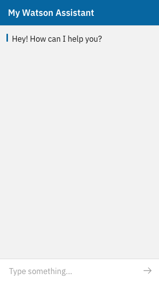

# Watson-Webchat

## Introduction 
This is a Node.js application that hosts a fullscreen web chat that integrates with IBM Watson Assistant. This application can be loaded into an iframe, which allows you to integrate it into a website.

## Technologies used

### Express
This application is based on a Node.js Express server, which serves a small HTML page (you can find the code in [index.js](index.js)). 

### IBM Webchat widget
The HTML contains a script that loads [IBM's webchat widget](https://web-chat.global.assistant.watson.cloud.ibm.com/docs.html). The documentation also [describes](https://web-chat.global.assistant.watson.cloud.ibm.com/docs.html?to=tutorials-carbon-themes). how you can customize the theme using pre-defined variables, as well as CSS.

## Prerequisites

- Install Node 12+ and npm (which is included with the node installer): [download page](https://nodejs.org/en/download/)
- You have a Watson Assistant project and enabled the [Web Chat integration](https://cloud.ibm.com/docs/assistant?topic=assistant-deploy-web-chat) (this requires the Plus or Premium plan)

## How to run the application

1. Open your favorite command line tool
2. `cd` to the root directory of this repository
3. Install dependencies
    - Run `npm install` (use `npm ci` when implementing CI/CD)
4. Setup environment variables
    - Copy the contents of the `env-example` file to a new file named `.env`
    - Make sure to provide values for all variables listed below `# Required`
    - Read [Generate RSA key](#Generate-RSA-key) to learn how to generate a keypair
    - Read [Watson Assistant Web Chat - Getting started](https://web-chat.global.assistant.watson.cloud.ibm.com/docs.html?to=tutorials-getting-started) to learn where to find the Watson settings
5. Start the application
    - Run `npm run start`
6. The console should now show what the url is for accessing it

## Generate RSA key

Run the following commands to generate a 2048-bit RSA256 keypair.
```
openssl genrsa -out private.pem 2048
openssl rsa -in private.pem -pubout -out public.pem
```
The result is 2 files:
- **private.pem**
  - The private key must only be available to this application. You need it to set the environment variable called `WATSON_RSA_KEY`. The .pem file contains linebreaks, look at [env-example](env-example) how to use multiline strings (converting linebreaks in `\n`).

- **public.pem**
  - You need the public key in Watson Assistant to 'whitelist' it
  > By providing IBM with a public key to verify RS256 signed messages, we can make sure that Web Chat traffic is coming from you and that any user information you provide is secure and accurate.

## Contribute

If you would like to contribute to this project, you are very welcome to do so. You can either fork this project and make Pull Requests from there, or [Create an issue](https://github.com/EdwinOtten/Watson-Webchat/issues/new) and ask me to add you as a collaborator.

## License

This software is published under the [ISC License](https://opensource.org/licenses/ISC). Which basically means _"free to use for whatever you want as long as you include the copyright notice"_, which you can find in the [LICENSE file](LICENSE)).

---

## What does it look like?


